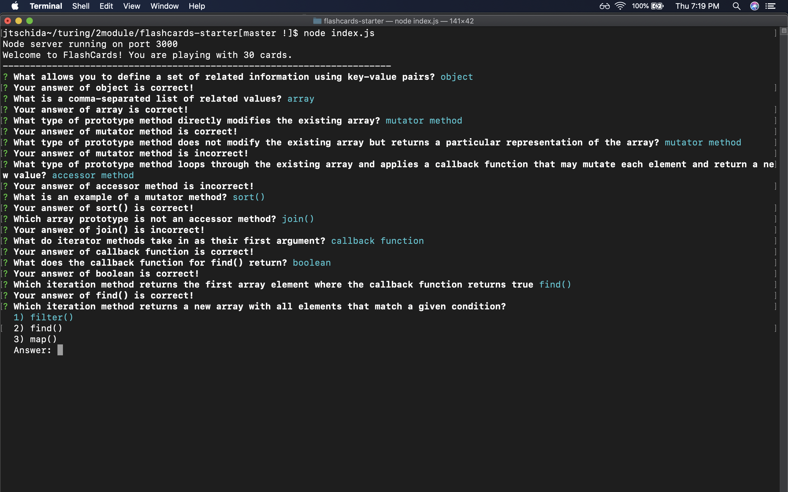

# Flash Cards Solo Project
by Jonathan Tschida

## Abstract
This is a solo project assigned during Mod 2 at Turing.  We were provided with some basic set up files and asked to create an app that presents the user with flashcards to answer via the command line. The goal of the project was to make us more familiar with TDD (Test Driven Development) as well as OOP (Object Oriented Programming).

## Running the Application
1. Clone down the repo with `git clone`
2. Run `npm install` to use nodeJS
3. Start the program by typing `node index.js`
4. Select your answer by typing the number or using the arrow keys
5. Hit enter to submit your answer
